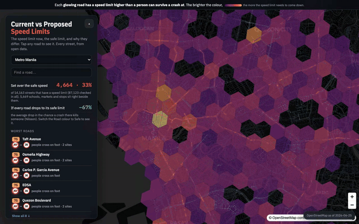
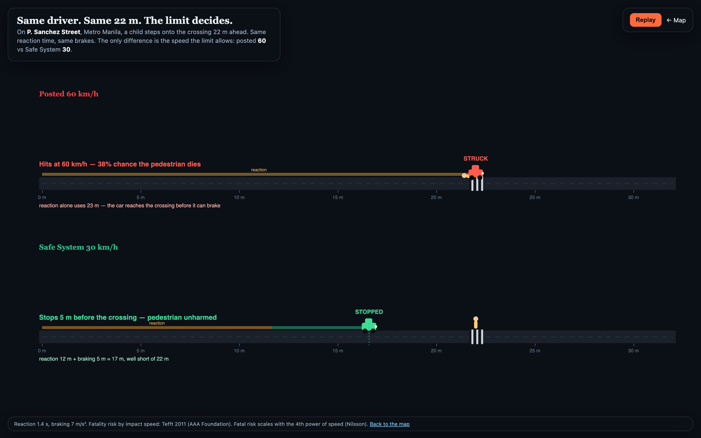

# Will a lower speed limit actually make us safer?

> Metro Manila is gridlocked, so a lower speed limit can feel beside the point. But the slow pace
> comes from traffic, and the road underneath is built for far more. On EDSA, total crashes peak
> in rush-hour traffic. Yet the share that injure or kill roughly doubles between midnight and
> 5am. That is when the road clears and
> vehicles reach the speed it is built for: 13.5% against 6.7%, about 2x (p < 0.001, Mendeley EDSA
> 2007-2016: 22,072 crashes, 1,504 of them injury-or-worse). This is one road, and the late-night hours carry less enforcement and
> more drinking, so it points to speed rather than proving it. You are exposed to the top speed a road permits
> near you, not the average. This open map scores every street in 50 Philippine cities and Metro Manila against the
> speed a person survives a crash at: 357,423 scored from OpenStreetMap, 9,435 posted above the safe
> speed, 5,328 in Metro Manila. Satellite imagery shows the flagged roads for what they are,
> wide straight multi-lane roads through dense housing, built for a speed no sign and no traffic
> jam changes. And the danger does not track wealth, across the 43 cities with enough data the link is
> significant in only four ([findings](docs/findings.md)).

[](https://ai4saferroads-ph.vercel.app)
[](LICENSE)
[](LICENSE)
[](build/web/methodology.html)
[](https://www.openstreetmap.org)
[](docs/cities.md)
[](tests/e2e.sh)
[](#limitations)

[](https://ai4saferroads-ph.vercel.app)

<sub>Real recording of the live map (via `build/record_demo_15s.mjs`), subtitled so it reads without
sound. It opens on 12,563 reported crash sites over real satellite imagery, where 76% of them land
on the 8.5% of road the model flags, dives to street level over ten-lane EDSA to show the road those
reports sit on, then flips every road to the speed a person survives. Watch it live at
[ai4saferroads-ph.vercel.app](https://ai4saferroads-ph.vercel.app).</sub>

## What it shows

The question is not whether drivers speed. It is whether the road itself permits a lethal speed
next to people, however slow the daytime traffic runs. For every drivable road segment the model computes:

- a **Safe System recommended speed** from the road's class and the vulnerable-user sites
  around it (schools, markets, hospitals, transit),
- the **gap** to the **posted limit** (OpenStreetMap `maxspeed`),
- a **free-flow design speed** the built form invites when the road is clear, from class and
  alignment, so the score does not depend on the congested average (a transparent class-based
  estimate, labelled as one),
- a **Speed Safety Score** (0 to 100) that weights the gap by pedestrian exposure,
- the **recommended limit** and the **modeled fatal-risk reduction** from adopting it.

Roads with a real posted limit above the safe speed glow from yellow to magenta. Roads whose
limit had to be imputed from their class are shown faint and dashed, kept out of the headline
counts. The official ADB GPS-probe data drops into the same segment schema when available,
replacing imputed limits and adding a measured operating-speed layer.

## Is speed even the problem?

The honest objection is that Philippine cities are gridlocked, so real speeds sit far below the
posted limit most of the day. The answer follows the data, in three moves.

1. **The harm hides in the clear-road hours.** On the Mendeley EDSA crash set (22,072 records,
   2007-2016), total crashes peak in the rush hour, tracking traffic volume. But the share of
   crashes that injure or kill roughly doubles when the road clears: **13.5%** in the late-night
   window (12am to 5am) against **6.7%** in the rush-hour peak, about **2x** (chi-square p = 1.3e-18,
   on a set holding 1,504 injury-or-worse crashes). The clear-road hours carry less enforcement and more
   impaired driving too, so this points to speed, it does not prove it alone. Night property-damage-only
   crashes are also likely under-reported (fewer police out, the alert feeds skew to daytime), which
   shrinks the denominator and can inflate a casualty share on its own. It is one road, EDSA,
   and its 22 fatal crashes are too few to read hour by hour, so the test runs on injury-or-worse crashes,
   not deaths alone. The naive "crashes happen at night" claim stays false: crashes peak in daytime
   traffic, it is their severity that peaks when the road clears.
2. **From space, the flagged roads are built for speed.** OpenStreetMap has no width tag on most
   arterials, so the satellite closes the gap. The flagged roads are wide, straight, multi-lane
   strips through dense housing: EDSA (ten-plus lanes), Taft Avenue, Cebu's Natalio Bacalso Avenue,
   the new Davao City Coastal Road. Congestion is temporary. The road itself is not.
3. **The fix is physical, not a sign.** A lower number no one obeys in traffic and no one enforces
   changes nothing. Only road design that caps speed when the road is empty works, and only **20%**
   of Manila's flagged roads have any traffic calming within 100 m (16% in Cebu, 4% in Davao).

Reproduce: `python3 build/overlay/emit_severity_artifact.py <EDSA.xls>` (the severity chart),
`python3 build/overlay/satellite_evidence.py` (the crops), `tmp/verify-*/PHASE1_VERDICT.md` (the
full test and its confounds).

## See why the limit is the story

[](https://ai4saferroads-ph.vercel.app/sim.html)

<sub>[Live](https://ai4saferroads-ph.vercel.app/sim.html): the same driver, the same 22 m,
on a real flagged road (P. Sanchez Street, Metro Manila). At the posted 60 km/h the
reaction distance alone (23 m) is longer than the gap, so the car reaches the crossing before
it can brake and strikes the pedestrian, a 38% fatality risk (Tefft 2011). At the Safe System
30 km/h the same car stops 5 m short. The contrast comes from real reaction-and-braking
physics, drawn so you can see where each car stops.</sub>

## Cities (live OpenStreetMap, June 2026)

50 cities and Metro Manila are scored, from the capital out to regional centres across Luzon, the Visayas, and
Mindanao. The top of the list by flagged-road count:

| City | Streets scored | With a real posted limit | Flagged: limit over safe speed | Vulnerable-user sites |
|------|----------------:|-------------------------:|-------------------------------:|----------------------:|
| Metro Manila | 87,123 | 14,163 | 5,328 | 5,669 |
| Cebu City | 22,402 | 2,027 | 727 | 858 |
| Davao City | 10,873 | 2,658 | 435 | 466 |
| San Fernando (Pampanga) | 10,209 | 708 | 322 | 342 |
| Angeles City | 14,211 | 974 | 243 | 431 |
| Calamba | 9,499 | 698 | 229 | 284 |
| Iloilo City | 6,433 | 758 | 199 | 398 |
| Cagayan de Oro | 8,555 | 441 | 148 | 307 |
| Iligan City | 2,265 | 176 | 117 | 176 |
| Koronadal | 3,274 | 476 | 105 | 86 |
| Bacolod | 8,167 | 475 | 98 | 258 |
| Malolos | 7,025 | 212 | 93 | 277 |
| **50 cities + Metro Manila** | **357,423** | **37,971** | **9,435** | **16,399** |

Full per-city numbers are in [docs/cities.md](docs/cities.md). The whole urban network of each
city is pulled, scored, and served as vector tiles so the entire street grid draws at once.
Posted-limit coverage in OpenStreetMap varies a lot: dense in Metro Manila, thin in smaller
cities, and sparse enough in two (Butuan, Puerto Princesa) that they carry no
flagged roads at all. That gap is the point, not a flaw: it is exactly where official
posted-limit data would add the most.

Three patterns fall out of the data, and none goes the way you would guess. The mismatch does
not track wealth. It does sit on the crowded arterials (WorldPop puts a median 12,916 people per
km² around a flagged road, against 9,450 for one that fits), yet the size of the gap does not
track how crowded a place is. And the crowded, most-flagged region, Metro Manila, has the
country's lowest road-death rate, because the deaths are on rural highways and counted by region
of residence. The crowded, the mismatched, and the deadly are three different maps. Full numbers
and the "speed risk × crowding" overlay: [docs/findings.md](docs/findings.md).

## What's in this repo

- `build/sss_pipeline.py`: pulls live OpenStreetMap road geometry, posted limits, and
  vulnerable-user sites for any city, computes the Speed Safety Score, and writes per-city GeoJSON.
- `build/web/index.html`: the map: every street scored (MapLibre + PMTiles), a city selector
  grouped by island, a guided "critical roads & why" mode, "speed risk × wealth" and "speed risk
  × crowding" overlays, and a city-wide modeled fatal-risk cut. Single static file. Built for a
  non-technical reader: search the flagged roads in the loaded city by name (not just the worst
  list), a shareable link per road (`#city/road-name`), an English/Filipino toggle, a my-location button
  that finds the nearest flagged road, a straight-line route check between two tapped points,
  a pre-filled report-a-road letter for the city engineering office, survival odds in every road
  popup (Tefft 2011), CSV download next to the GeoJSON, a printable one-page city summary, a
  "how does my city compare" ranking, and an `?embed=1` mode for newsrooms (iframe recipe on the
  methodology page). No login, no account, no tracking cookies. If the map engine or a tile
  source fails, the page says so instead of going dark.
- `build/overlay/`: `enrich_worldpop.py` folds WorldPop population density into the exposure
  weight. `compute_overlay.py` joins the scores to Meta's Relative Wealth Index and computes the
  Spearman correlations + Moran's I. `correlate_crowd_deaths.py` builds the crowding-and-deaths
  analysis (see `docs/findings.md`).
- `build/web/sim.html`: the stopping-distance comparison (2D canvas, 60 vs 30 km/h).
- `build/web/methodology.html`: the full method and sources.
- `tests/e2e.sh`, `tests/test_pipeline.py`, `tests/check_invariants.py`: unit, wiring, and
  invariant checks.
- `decision/`: the research and decision trail. `research/`: the product audit.

## Run it

```sh
make data     # pull live OSM and score all cities (slow: Overpass rate limits, 2 s between queries)
make serve    # http://127.0.0.1:8799/web/index.html  (Range-capable serve.py)
make e2e      # unit + wiring + invariant checks, all pass
make shot     # render screenshots (needs node + playwright chromium)
```

The pipeline uses the Python standard library only (plus `tippecanoe` on PATH to build the
vector tiles). The site is static. Deploy is a single `vercel --prod` from `build/web`.

Notes for a fresh clone: `build/web/data/sss_all.pmtiles` is a build artifact (34 MB,
gitignored), so run `make data` once before the first full `make e2e` or deploy.
`E2E_SKIP_PMTILES=1 bash tests/e2e.sh` runs everything else without it (this is what CI does),
and `E2E_SMOKE=1` adds a real-browser smoke test. The screenshot and demo tooling needs
`cd build && npm install` (pins playwright). CI runs ruff, pytest, and the e2e suite on every
push; a scheduled workflow pings the live site every two hours and fails loudly if the page or
its headline goes missing.

After changing `build/sss_pipeline.py` scoring inputs without wanting a fresh OSM pull, use
`python3 build/rescore_pois.py`: it recomputes exposure and scores from the cached
`build/_fullnet/` segments, keeps the data vintage, asserts that no flagged count moves, and
re-tiles the PMTiles.

## Method, briefly

Safe System survivable speeds, 30 km/h where people walk, 50 at side-impact intersections,
70 on a divided carriageway, 100 grade-separated, come from Tingvall and Haworth (1999),
ITF/OECD *Speed and Crash Risk* (2018), and the WHO Speed Management Manual. The
speed-to-fatality relationship is the Nilsson power model (1981): fatal crash risk scales with
the fourth power of speed, so 60 to 30 km/h is about a 94% modeled reduction. Pedestrian
fatality risk by impact speed in the comparison view follows Tefft (2011, AAA Foundation).
Full spec and sources: [methodology page](build/web/methodology.html).

This matters in the Philippines specifically: WHO (2023) estimates 11,062 road deaths, on a
fleet where powered two- and three-wheelers are the largest vehicle class, and rider deaths
lead the toll (53% of reported fatalities in WHO's 2015 report, the last with a usable rider
breakdown). The national urban limit is 40 km/h, but local governments set their own
limits, which is how posted limits drift out of step with the road.

## Does it line up with real crashes?

The model applies a published physical law (Nilsson). It does not prove one. But the map's
output can be tested. Joining the 12,563 geolocated Metro Manila crashes the map shows (2018-2020,
MMDA traffic alerts) to the scored network, 12,457 (99%) fall within 30 m of a scored road. The
flagged roads are 8.5% of the network length but carry 76.2% of them, and on a 550 m grid
normalized for road length, crash density rises with the score (Spearman +0.46 over 1,222 cells).
The flags land where crashes concentrate. This is an
association on a convenience sample biased to arterials, with no traffic-volume control, so it is
consistent with the model, not proof a limit causes a crash. A regional cross-check against PSA
death rates behaves differently, and is expected to (deaths are by region of residence, not crash
site, so Metro Manila has the most flagged roads yet the lowest death rate). Full method, numbers,
and caveats: [docs/validation.md](docs/validation.md).

## Limitations

- OpenStreetMap posted-limit coverage varies by city. Imputed limits are flagged, drawn faint,
  and kept out of the headline counts. A few cities have so little posted data they carry no
  flagged roads.
- The recommended-speed classifier is a transparent heuristic from open tags. Intersection
  density and divided-carriageway detection are not yet computed, so arterials default to the
  side-impact survivable speed (50) unless OSM marks them divided.
- Exposure combines point-of-interest proximity with WorldPop residential density. It still
  does not capture daytime foot traffic or measured traffic volume.
- This is a screening layer to prioritize segments for review, not a final determination.

## Related work

iRAP Star Rating (operating-speed road risk, ViDA platform), World Bank GRSF *Guide for Safe
Speeds* (2024, guidance), and FHWA USLIMITS2 (an expert system for setting limits). This
project adds an open, network-scale layer comparing posted limits to Safe System speeds from
OpenStreetMap, and a way to see what a given gap does to a person.

## Disclaimer

Indicators are derived from open data and published road-safety research. A flag means a
segment warrants review, not that any posted limit is wrong. Limits may have local context
this screening does not capture. Not affiliated with ADB, WHO, the World Bank, or iRAP.

## License

Code MIT. Derived data CC-BY-4.0. Road and satellite data © OpenStreetMap contributors
(ODbL), © Esri, Maxar, Earthstar Geographics, © CARTO.

## Sources

Tingvall and Haworth (1999) · ITF/OECD, *Speed and Crash Risk* (2018) · WHO Speed Management
Manual · Nilsson (1981) power model, Elvik updates · Rosén and Sander (2009) · Tefft (2011),
AAA Foundation · WHO Global Status Report on Road Safety 2023 (Philippines) · OpenStreetMap.
